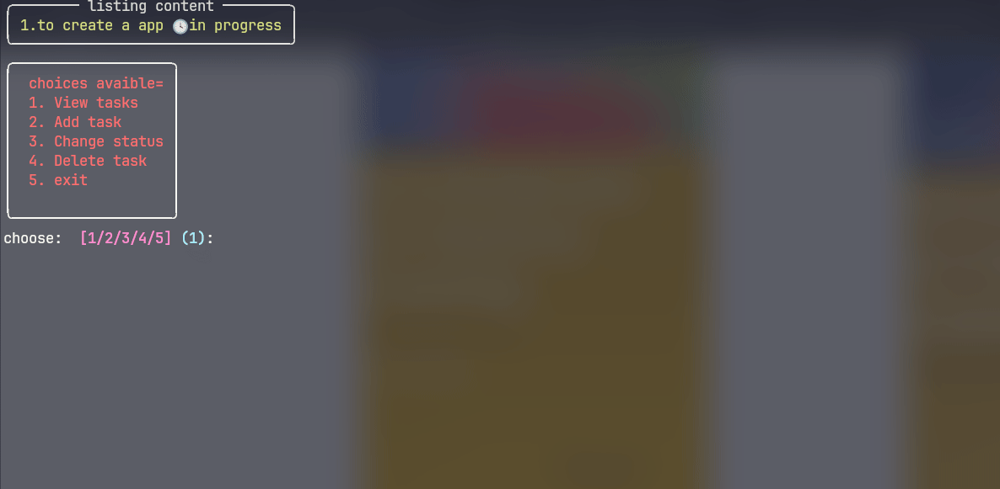

# Todo App

A simple command-line todo application written in Python.

## Description

This is a simple todo application that runs in the terminal. It allows you to add, view, update, and delete tasks. The tasks are stored in a `tasks.json` file in the same directory.

## Installation

1.  Clone the repository:
    ```bash
    git clone https://github.com/jeevin17/todo-app.git
    ```
2.  Navigate to the project directory:
    ```bash
    cd todo-app
    ```
3.  Install the dependencies:
    ```bash
    pip install -r requirements.txt
    ```

## Usage

To run the application, simply run the `todo.py` file:

```bash
python todo.py
```

You will be presented with a menu of options to choose from:

```
 choices avaible=
 1. View tasks
 2. Add task
 3. Change status
 4. Delete task
 5. exit
```

## Demo



## Contributing

Contributions are welcome! If you have any ideas, suggestions, or bug reports, please open an issue or submit a pull request.

## License

This project is licensed under the MIT License. See the [LICENSE](LICENSE) file for details.
